<h1 data-importer="text" align="left">Yeee-Haw 👋</h1>

###

I'm João, Senior .Net back end Engineer with some front end adventures

###

<h2 data-importer="text" align="left">About me</h2>

###

💻 I’m a .Net fan, but I also have worked with Java 📫 How to reach me: https://www.linkedin.com/in/joao-audibert/ ⚡ Fun fact: Mike Tyson is my brother 🥋 🧜‍♂️ One of the creators of Four Lines

###

<h2 data-importer="text" align="left">I code with</h2>

###

  
  
  
  
  
  
  
  
  
  
  
  
  

###

  
  

###
